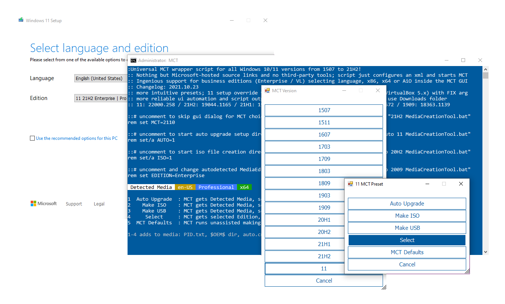

Pas seulement un script enveloppant Universal MediaCreationTool avec un support ingénieux pour les éditions commerciales,
  
Un outil d’automatisation de déploiement Windows 10/11 puissant et simple!  

Presets  
-------  
1 ***Mise à niveau automatique*** avec les supports détectés, le script aide setupprep pour la mise à niveau directe
> _- peut conserver des fichiers et des applications sur plusieurs scénarios où os et l’édition cible ne correspondent pas match_
> _- peut changer l’édition détectée en ajoutant EditionID au script name_
> _- peut résoudre les problèmes de mise à niveau en ajoutant no_update’ au script name_

2 ***ISO automatique*** avec le support détecté dans le dossier courant directement _(ou C:\ESD si exécuté à partir de zip)_
> _- peut surcharger les supports détectés en ajoutant le nom de l’édition / la langue / l’arc au nom du script name_

3 ***USB automatique*** avec support détecté dans la cible USB spécifiée
> _- pour la sécurité des données, ce n’est pas entièrement automatisé - doit sélectionner la clé USB manuellement dans GUI_

4 ***Séléctionner*** avec l’utilisateur choisi Edition, Language, Arch (x86,x64,both) - sur la cible spécifiée
> _- choix implicite, inclut les fichiers de priorité de configuration (désactiver en ajoutant `def' au nom du script)_

1 à 4 préréglages modifieront le support créé de la manière suivante :
> _- écrire « auto.cmd » pour exécuter à la demande sur le support pour la mise à niveau automatique avec prise en charge du commutateur d’édition et sauter tpm_
> _- écrire le dossier $OEM$’ (s’il existe) avec des réglages post setup comme $OEM$ $$ Setup Scripts setupcomplete.cmd`_
> _- écrire « sources PID.txt » pour présélectionner l’édition au démarrage du support ou à la configuration dans Windows (si configuré)_
> _- écrire « sources EI.cfg » pour empêcher l’invite de clé de produit sur les médias grand public Windows 11 (11 seulement)_
> _- écrire « AutoUnattend.xml » dans boot.wim pour activer le compte local sur Windows 11 Home (11 uniquement)_
> _- patch `winsetup.dll’ in boot.wim pour supprimer les contrôles de configuration de Windows 11 lors du démarrage depuis un support (11 uniquement)_
> _- peut être désactivé en ajoutant `def’ au script name_

Simple deployment  
-----------------   
**auto.cmd** est derrière ***Auto Upgrade*** préréglage via GUI, 
ou complètement inusité en renommant le script avec « auto MediaCreationTool.bat »
Devrait rendre facile de mettre à niveau la conservation des fichiers et des applications lorsque l’édition du système d’exploitation ne correspond pas au support créé
Le script généré est ajouté au support créé afin que vous puissiez l’exécuter à nouveau à tout moment
Il est assez générique - il détectera les éditions disponibles dans install.esd, choisir un index approprié, puis
mettre à jour EditionID dans le registre pour correspondre à la cible; peut même forcer la mise à niveau vers une autre édition, en conservant les fichiers et les applications!
Définit également les options de configuration recommandées avec le moins de problèmes sur les mises à niveau

> Supposons que le système d’exploitation actuel est Enterprise LTSC 2019 et que vous utilisez le média d’affaires pour mettre à niveau :
> **auto.cmd** sélectionne Enterprise index et ajuste EditionID à Enterprise dans le registre (sauvegardé en tant que EditionID_undo)
> Peut-être que vous voulez aussi changer d’édition,
> ex. en renommant le script en « ProfessionalWorkstation MediaCreationTool.bat » :
> **auto.cmd** sélectionne Professional index et définit EditionID à ProfessionalWorkstation dans le registre.
> Disons que le système d’exploitation est Windows 7 Ultimate ou PosReady et que vous utilisez les médias grand public pour mettre à niveau :
> **auto.cmd** sélectionne Professional index et définit EditionID à Professional ou Enterprise, respectivement.
> Dans tous les cas, le script tente de choisir un index existant, sinon un index compatible pour conserver les fichiers et les applications à la mise à niveau.
>
> Disons que vous avez une douzaine de PC répartis avec les versions : 7, 8.1, 10 et les éditions : Ultimate, Home, Enterprise LTSB..
> Si vous devez tout mettre à niveau vers la dernière version 10 et n’utiliser que Pro, vous pouvez renommer le script comme suit :
> « auto 21H2 Pro MediaCreationTool.bat »
> Peut même ajouter une clé de produit VL / MAK / retail de la même manière pour régler les différences de licence.
> Le script récupère également tout dossier « $OEM$» à l’emplacement actuel - pour une image de marque unifiée, une configuration, des réglages, etc.
Windows 10  
----------  
[MediaCreationTool.bat](MediaCreationTool.bat) fonctionne sans heurt, ne pas avoir à faire face à des contrôles d’installation anti-consumeur..

Windows 11 et les contrôles de configuration TPM / SecureBoot / CPU / Storage 
----------------------------------------------------------------  
[MediaCreationTool.bat](MediaCreationTool.bat) crée 11 supports qui **sauteront automatiquement les vérifications d’installation propres**
***La mise à niveau automatique*** prédéfinie ou le lancement du fichier auto.cmd à partir du support créé **sautera automatiquement les vérifications de mise à niveau**
L’exécution du fichier setup.exe à partir du support créé ne contourne pas les vérifications de configuration - utilisez plutôt le fichier auto.cmd!
Pour NE PAS ajouter de dérivation au support, utilisez le préréglage ***MCT Defaults*** ou renommez le script en « def MediaCreationTool.bat ».

> Concernant la méthode de dérivation, pour une expérience plus fiable et pérenne,
> l’installation propre est toujours gérée via le correctif _winsetup.dll_ dans _boot.wim_
> la mise à niveau est désormais gérée uniquement via le fichier auto.cmd avec l’astuce */Product Server*
> *Ignorez simplement l’étiquette « Windows Server », s’il vous plaît! *
Noter que [Skip_TPM_Check_on_Dynamic_Update.cmd](bypass11/Skip_TPM_Check_on_Dynamic_Update.cmd) agit globalement et **sautera les vérifications de mise à niveau via setup.exe**

Obtenez RP/BETA/DEV 11 via Windows Update sur le matériel "non pris en charge"
---------------------------------------------------------------  
Etape 1 : utiliser [Skip_TPM_Check_on_Dynamic_Update.cmd](bypass11/Skip_TPM_Check_on_Dynamic_Update.cmd) pour contourner automatiquement les exigences de configuration
_C’est un script set it and forget it, avec undo intégré - v7 utilisant plus fiable /Product Server trick_

Etape 2 : vérifier les mises à jour via Paramètres - Mise à jour de Windows et sélectionnez Mise à niveau vers Windows 11

Ont déjà un 11 ISO, USB ou fichiers extraits et veulent ajouter un bypass
----------------------------------------------------------------------  
Utilser [Quick_11_iso_esd_wim_TPM_toggle.bat](bypass11/Quick_11_iso_esd_wim_TPM_toggle.bat) du confort du clic droit - Menu SendTo

Bascule le type d’installation vers Server en sautant les contrôles d’installation, ou vers Client s’il est exécuté à nouveau sur le même fichier, en restaurant le hachage !
**directement** sur n’importe quel Windows 11 iso téléchargé ou extrait esd et wim, donc il n’y a pas de montage iso / dism
_courageusement quick_

Fonctionne très bien avec les médias d’affaires ou d’entreprise, car il est livré avec ei.cfg, de sorte que la configuration ne demandera pas de clé de produit au début
pour les médias grand public ou de base, vous pouvez ajouter vous-même un fichier générique « EI.cfg » aux sources de médias avec ce contenu :
«[Canal]»
«_Par défaut»

> si la configuration demande toujours une clé de produit, veuillez insérer la votre qui était sur le système d'exploitation Windows 10

Noter que [Skip_TPM_Check_on_Dynamic_Update.cmd](bypass11/Skip_TPM_Check_on_Dynamic_Update.cmd) **fonctionnera également pour la mise à niveau manuelle**
_indépendamment des supports iso / usb montés ayant déjà un bypass ajouté ou not_

Changelog  
---------  
_Pas besoin de cliquer avec le bouton droit de la souris sur Exécuter en tant qu’administrateur, le script se demandera. Enregistrer directement les fichiers bruts ne casse plus la ligne endings_
_Nous l’avons fait! Nous avons rompu [the previous gist](https://git.io/MediaCreationTool.bat)_ ;) C’est donc la nouvelle maison. **Merci à tous! **

[discuss on MDL](https://forums.mydigitallife.net/threads/universal-mediacreationtool-wrapper-script-create-windows-11-media-with-automatic-bypass.84168/)  

```
2018.10.10: reinstated 1809 [RS5]! using native xml patching for products.xml; fixed syntax bug with exit/b
2018.10.12: added data loss warning for RS5
2018.11.13: RS5 is officially back! + greatly improved choices dialog - feel free to use the small snippet in your own scripts
2019.05.22: 1903 [19H1]
2019.07.11: 1903 __release_svc_refresh__ and enable DynamicUpdate by default to grab latest CU
2019.09.29: UPDATED 19H1 build 18362.356 ; RS5 build 17763.379 and show build number
            added LATEST MCT choice to dinamically download the current version (all others have hard-coded links)
2019.11.16: 19H2 18363.418 as default choice (updated hard-coded links)
2020.02.29: 19H2 18363.592
2020.05.28: 2004 19041.264 first release
2020.10.29: 20H2 and aniversary script refactoring to support all MCT versions from 1507 to 20H2!!!
2020.10.30: hotfix utf-8, enterprise on 1909+
2020.11.01: fix remove unsupported options in older versions code breaking when path has spaces.. pff
2020.11.14: generate latest links for 1909,2004; all xml editing now in one go; resolved known cannot run script issues
2020.11.15: one-time clear of cached MCT, as script generates proper 1.0 catalog for 1507,1511,1703 since last update
            fixed compatibility with naked windows 7 powershell 2.0 / IPv6 / optional import $OEM$ / 1803+ business typo
            updated executables links for 1903 and 2004
2020.11.17: parse first commandline parameter as version, example: MediaCreationTool.bat 1909
2020.12.01: attempt to fix reported issues with 1703; no other changes (skipping 19042.630 leaked esd because it is broken)
2020.12.11: 20H2 19042.631; fixed pesky 1703 decryption bug on dual x86 + x64; improved cleanup; label includes version
2021.03.20: pre-release 21H1; optional auto upgrade or create media presets importing $OEM$ folder and key as PID.txt
2021.05.23: 21H1 release; enhanced script name args parsing, upgrade from embedded, auto.cmd / PID.txt / $OEM$ import
2021.06.06: create iso directly; enhanced dialogs; args from script name or commandline; refactoring is complete!
2021.08.04: done fiddling
2021.09.03: 21H2, both 10 and 11 [unreleased]
2021.09.25: Windows 11
            with Skip TPM Check on media boot as well as on dynamic update (standalone toggle script available)
            final touches for improved script reliability; enhanced auto upgrade preset; win 7 powershell 2.0 compatible
2021.09.30: fix Auto Setup preset not launching.. automatically
2021.10.04: fix for long standing tr localization quirks; Skip TPM Check v2 (ifeo-based instead of wmi)
2021.10.05: 11 22000.194 Release (rofl W11 MCT has limited capabilities, so still using 21H1 MCT because it works fine)
2021.10.09: outstanding refactoring around Windows 11 MCT; minimize while waiting MCT; unified 7 - 11 appearence
2021.10.20: create generic iso if no edition arg; use Downloads folder; no 11 setup checks on boot in VirtualBox; fixes #2
2021.10.23: 11 22000.258
            more intuitive presets; 11 setup override via AutoUnattend.xml or via boot.wim (for VirtualBox 5.x) with FIX arg
            only reliable ui automation; enhanced script output
2021.11.03: multiple download methods; improved automation; improved auto.cmd; moved autounattend.xml to boot.wim
            revising 11 setup bypass (wip) - not being content with any methods is the reason why I've not updated in a while
2021.11.09: skip windows 11 upgrade checks with setup.exe (not just auto.cmd); no server label; local account on 11 home
            auto.cmd has more fixes to keep files and apps on upgrade; reliable ui automation; alternative downloaders 
2021.11.15: 11 22000.318
            write output to script folder (or C:\ESD if run from zip); style: more consistent separation of arguments
            20H2 builds with esd size above 4GB that had to be reverted at 19042.631: en,de,es,pt,fr,it,jp,zh (MCT limits)
2021.11.16: 10 19044.1288 - official release of 10 21H2
            10 19043.1348 - newest 10 build - don't ask why ms is releasing these as such, it's not the first time
2021.12.07: skip windows 11 upgrade checks only via auto.cmd - just ignore server label, please
2021.12.15: fix regression with 1507-1709 not getting the correct fallback esd; fix dev '-noe' not autoclosing script
2021.12.22: improved auto.cmd handling of mismatched OS and target edition, obey 'def', 'auto' upgrades 7 to 10, not 11
```
